# Edge AI Cluster Orchestration System for Raspberry Pi

A turnkey controller-worker orchestration system that turns a stack of
Raspberry Pi 4/5 boards (optionally fitted with Hailo-8 AI HAT+ NPUs for RPi5) into
a load-balanced edge AI inference cluster. Designed as an
education-and-research testbed: plug a fresh Pi into the cluster's
switch, give it 30 seconds, and it's serving inference — no manual
flashing, no per-node config, no Kubernetes.


## What it does

- **Plug-and-play deployment.** Workers auto-onboard over SSH on the
  controller's private switch. A factory-flashed Pi → ACTIVE in ~30 s.
- **Heterogeneous compute.** Same code path drives ONNX Runtime on the
  CPU and Hailo Runtime on the Hailo-8 NPU — picked per-worker through a
  modular `InferenceModelEngine` abstraction. Models, adapters, and
  dispatchers are plug-in `.py` files.
- **Hardware power monitoring.** Custom INA226 PCB on the controller's
  I²C bus measures each worker's real power draw (the Pi 5's onboard
  PMIC doesn't cover the 5 V rail that feeds the NPU). 100 ms polling,
  SQLite time-series store.
- **End-to-end benchmarks.** Three inference modes (`tensor`, `raw`,
  `dummy`) cover everything from chip-throughput benchmarks to real
  image classification. Reports persist as time-stamped runs with
  per-worker percentiles, throughput, observed TOPS, and energy/request.
- **Live super-resolution demo.** `/live` page streams Real-ESRGAN
  upscaling of a video to MJPEG, with a slider to add/remove workers and
  watch the FPS change in real time.


### Cluster dashboard

The home page. Worker fleet at a glance, with switch-plane and
SSH-restart actions for stuck workers.

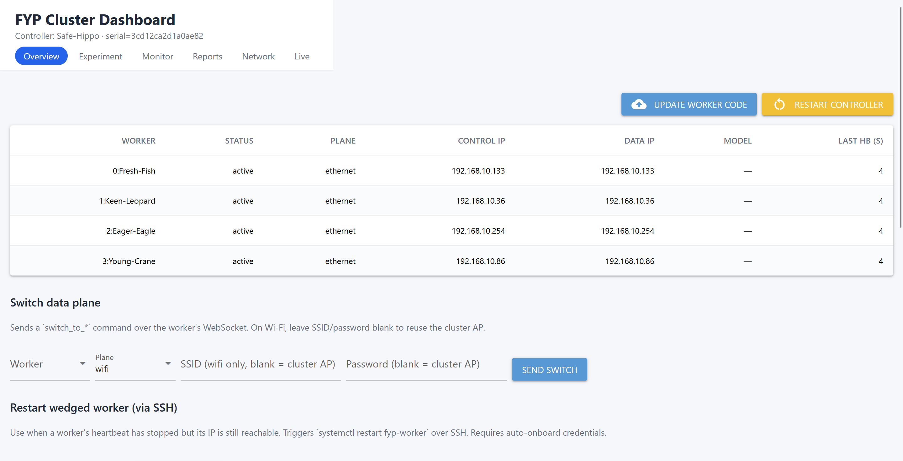

### Power-monitor bindings

Each INA226 chip on the I²C bus is mapped to a worker. The auto-
calibration routine bursts each worker's CPU in turn and binds it to
whichever chip's current spiked most — no manual wiring labels required.

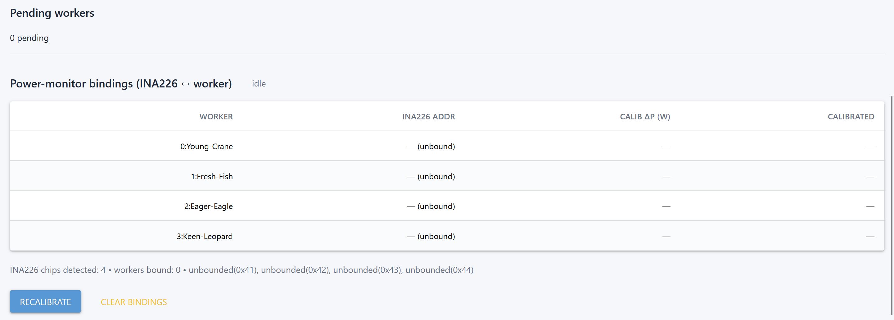

### Live calibration burst

While auto-calibration runs you can watch the CPU usage and temperature
climb on the target worker, with the matched INA226's power line
spiking in lock-step.

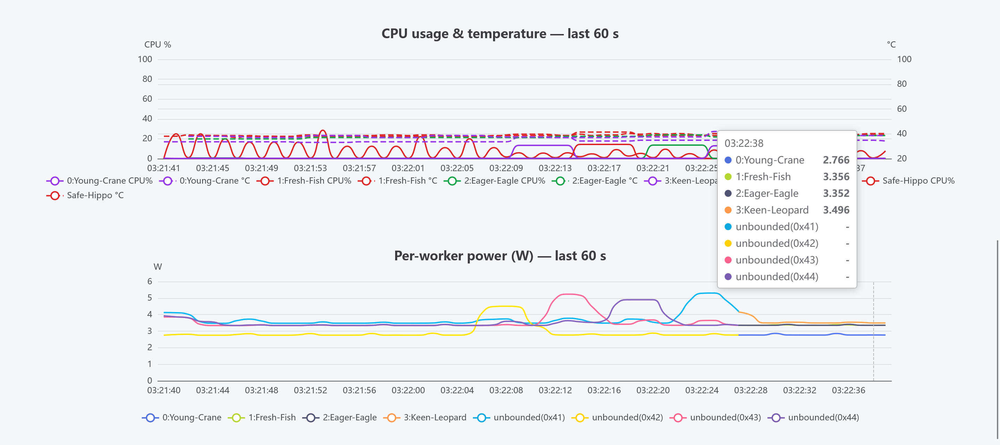

### Configure & launch experiment

Upload model, adapter, dispatcher, dataset; pick mode, duration, target
QPS; click Distribute → Launch. Adapters can declare their supported
inference modes (`SUPPORTED_MODES`) and the UI greys out unsupported
options automatically.

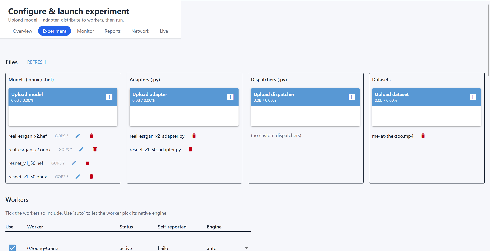

### Distribution status

After distributing `real_esrgan_x2` to four workers — two running the
ONNX backend on the Pi 5 CPU, two running the Hailo backend on the AI
HAT+. The badge column shows OK / pending / failed per worker.

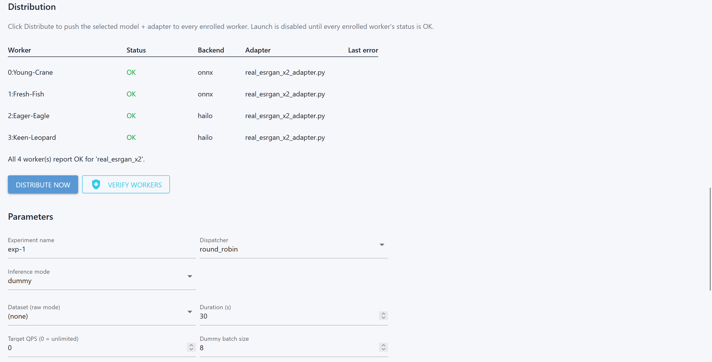

### Monitor during a run

CPU usage and temperature (dual y-axis, same colour per host) on the
left; per-worker power on the right. The two NPU workers ramp far less
than the CPU workers on Real-ESRGAN.

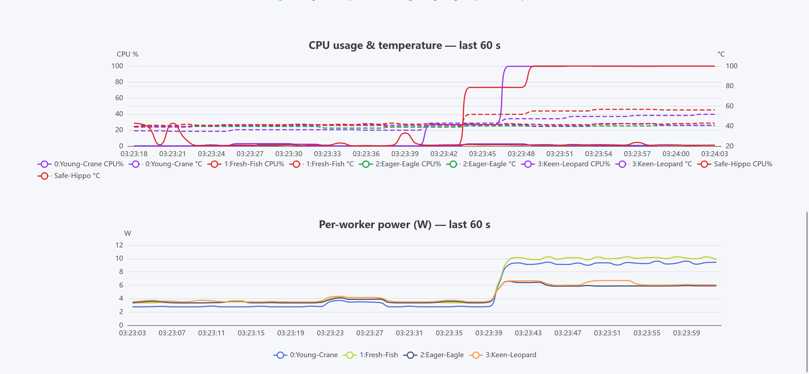

### Throughput at end of run

After the run finishes, the per-worker throughput chart shows the FPS
each worker sustained. With heterogeneous workers + round-robin
dispatch you can see the slow CPU workers becoming the cluster's
pacing bottleneck.

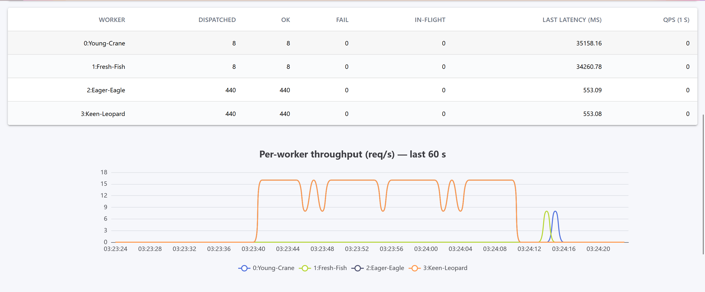

### Experiment reports list

Every completed run persists with model / dispatcher / mode / status,
latency percentiles, throughput, energy/request, and a notes field.
Click a row to drill down.

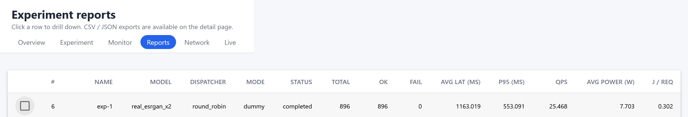

### Single experiment detail

Full breakdown — summary card with observed TOPS, power-over-time
chart, per-worker FPS / TOPS table, downloadable CSV/JSON exports.

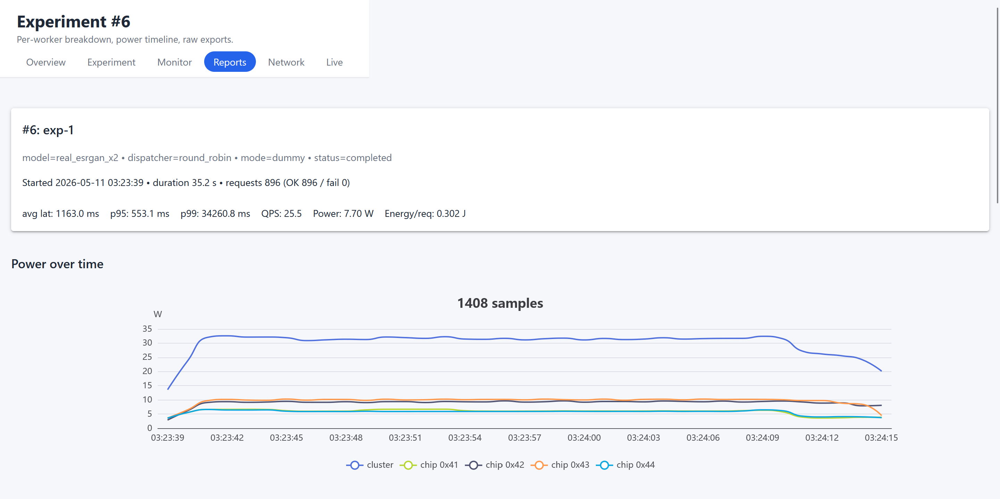
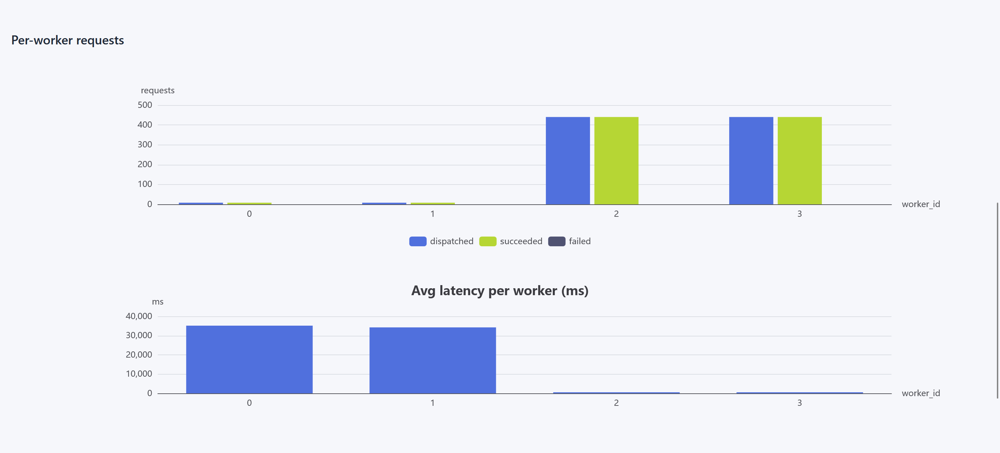
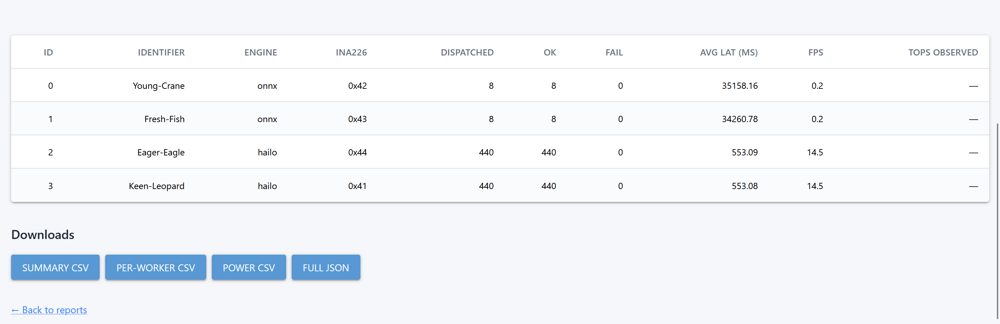

### Live SR demo

Real-time super-resolution: low-res video on the left, cluster-upscaled
on the right. Slider toggles active worker count to demonstrate
near-linear horizontal scaling. Each completed live run is also
persisted to `/reports` like a regular experiment.

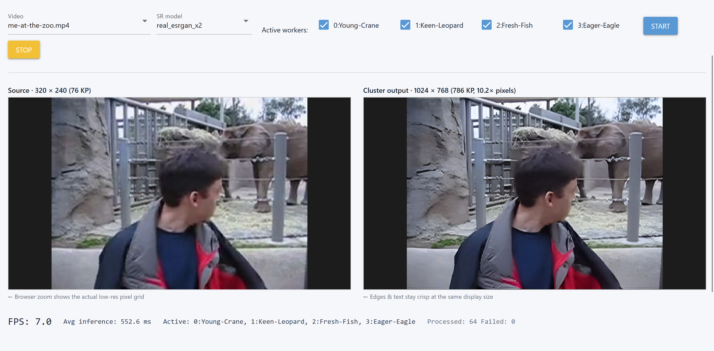


## Hardware

### Minimum testbed
- **Controller**: 1 × Raspberry Pi 4/5 (8 GB recommended)
- **Workers**: ≥ 1 × Raspberry Pi 4/5
- **Switch**: any 1 GbE unmanaged switch
- **Power**: 5V PSU, 5A per Pi

### To enable NPU benchmarks
- **Hailo-8 AI HAT+** on each worker that should run NPU inference
  (13 TOPS variant ≈ US $70, 26 TOPS variant ≈ US $110)

### To enable per-worker power monitoring
- One **INA226** breakout per worker on the controller's I²C bus
  (4 chips wired in our testbed; up to 16 supported via A0/A1 addr pins)
- 10 mΩ shunt resistor + 5.5 A resettable fuse per channel
- The PCB schematic is documented in §4.5 of the project report

### Software stack
- Raspberry Pi OS Bookworm (64-bit) on every node
- Python 3.11
- `uv` for venv management (auto-installed by the bootstrap scripts)
- `hostapd` + `dnsmasq` + `NetworkManager` on the controller


## Quick start

### 1. Stage the controller

```bash
# on the controller Pi
git clone https://github.com/SyntaxaR/fyp_cluster.git ~/fyp_cluster && cd ~/fyp_cluster
cp config.toml.example config.toml          # edit if needed
sudo bash controller.sh                     # one-shot install + run
```

Defaults: the controller broadcasts an open Wi-Fi AP `FYPClusterAP` for
operator browser access, sets `eth0` to `192.168.10.1/24`, and serves
DHCP on the ethernet subnet. Open `http://192.168.10.1:8080` from your
laptop (connected to the AP or to the wired switch) to reach the
dashboard.

### 2. Add workers

Wire a flashed Pi (any current Raspberry Pi OS image with the default
`pi` / `raspberry` credentials) into the switch. Within ~30 seconds the
controller's auto-onboard scans the DHCP leases, SSHes in, installs
`fyp-worker.service`, and the new node appears as ACTIVE on the
dashboard.

### 3. (Optional but recommended) Install Hailo SDK on NPU workers

If a worker has the AI HAT+ installed, install the Hailo runtime
**before** the worker joins, so the bootstrapper detects the NPU at
first boot:

```bash
# on the worker Pi
sudo apt update
sudo apt install -y hailo-all
sudo reboot
```

Workers without the SDK fall back to ONNX Runtime on the CPU
automatically — no config change required.

### 4. Run your first experiment

On `/experiment`:
1. Upload a model (`.onnx`, `.hef`) and matching adapter `.py`
2. Tick the workers to enroll
3. Click **Distribute now**, wait for all badges to go green
4. Pick mode (`dummy` for chip benchmarks, `raw` for end-to-end), set
   duration, click **Launch**
5. Watch the live throughput on `/monitor`; results appear on
   `/reports` when the run finishes


## Bundled models & adapters

Two reference models ship with adapter implementations in
`demo`. Both adapters auto-detect the engine's preferred
layout (NCHW for ONNX, NHWC for Hailo) and dtype (FLOAT32 forced over
the Hailo binding), so the same `.py` file drives both backends without
code changes.

### `resnet_v1_50` — image classification, benchmark-only

A standard ResNet-50 used for raw NPU/CPU compute benchmarking (MLPerf
reference network). The bundled adapter
(`demo/resnet50_adapter.py`) declares
`SUPPORTED_MODES = {"dummy"}` — real-image classification is out of
scope; this model is here to measure observed TOPS via the dummy-mode
pipeline.

| File | Source |
|---|---|
| `resnet_v1_50.onnx` | [hailo-model-zoo.s3.eu-west-2.amazonaws.com/Classification/resnet_v1_50/pretrained/2025-01-15/resnet_v1_50.zip](https://hailo-model-zoo.s3.eu-west-2.amazonaws.com/Classification/resnet_v1_50/pretrained/2025-01-15/resnet_v1_50.zip) (extract `resnet_v1_50.onnx`) |
| `resnet_v1_50.hef` | [hailo-model-zoo.s3.eu-west-2.amazonaws.com/ModelZoo/Compiled/v2.18.0/hailo8/resnet_v1_50.hef](https://hailo-model-zoo.s3.eu-west-2.amazonaws.com/ModelZoo/Compiled/v2.18.0/hailo8/resnet_v1_50.hef) (direct download) |

Then on `/experiment`:
- **Model**: `resnet_v1_50`
- **Adapter**: `resnet50_adapter.py`
- **Mode**: `dummy` (the only mode this adapter supports — `raw` and
  `tensor` are auto-hidden in the dropdown)
- **Duration**: 30 s, **Target QPS**: 0
- Enroll a single worker at a time for a clean per-chip number; the
  Hailo path should report ≈ 1300-1400 FPS / ≈ 9-10 TOPS, the
  ONNX/CPU path ≈ 0.4-0.6 FPS / ≈ 0.003 TOPS.

### `real_esrgan_x2` — super-resolution, full pipeline

Real-ESRGAN x2 (2× spatial upscaling) drives the `/live` super-
resolution demo. The bundled adapter
(`demo/real_esrgan_x2_adapter.py`) implements all three
inference modes including the full image preprocess / postprocess
pipeline (letterbox to square, BGR↔RGB, JPEG decode/encode, aspect
ratio crop on the output).

| File | Source |
|---|---|
| `real_esrgan_x2.onnx` | [hailo-model-zoo.s3.eu-west-2.amazonaws.com/SuperResolution/Real-ESRGAN/Real_ESRGAN_x2/pretrained/2024-10-31/RealESRGAN_x2_sim.zip](https://hailo-model-zoo.s3.eu-west-2.amazonaws.com/SuperResolution/Real-ESRGAN/Real_ESRGAN_x2/pretrained/2024-10-31/RealESRGAN_x2_sim.zip) (rename `RealESRGAN_x2_sim.onnx` to `real_esrgan_x2.onnx`) |
| `real_esrgan_x2.hef` | [hailo-model-zoo.s3.eu-west-2.amazonaws.com/ModelZoo/Compiled/v2.18.0/hailo8/real_esrgan_x2.hef](https://hailo-model-zoo.s3.eu-west-2.amazonaws.com/ModelZoo/Compiled/v2.18.0/hailo8/real_esrgan_x2.hef) (direct download) |

Then on `/experiment` distribute the model + adapter to your enrolled
workers, and on `/live`:
- **Video**: the mp4 you just uploaded
- **SR model**: `real_esrgan_x2`
- Tick the workers you want active; drag the active-worker count to
  see FPS scale near-linearly with worker count.
- Tick **Record next run to mp4** before clicking Start to also save
  the upscaled stream under `recordings/`.


## Architecture overview

```
                ┌───────────────────────────────────┐
                │           Controller Pi           │
                │  ┌─────────────────────────────┐  │
                │  │  Web UI (NiceGUI :8080)     │  │
                │  │  Control API (FastAPI :8001)│  │
                │  │  Data  API (FastAPI :8002)  │  │
                │  └─────────────────────────────┘  │
                │  ┌─────────────────────────────┐  │
                │  │ hostapd · dnsmasq · INA226  │  │
                │  └─────────────────────────────┘  │
                └────┬───────────┬───────────┬──────┘
                     │           │           │
                  eth0          I²C        wlan0
                     │           │           │
              ┌──────┴──────┐    │    ┌──────┴──────┐
              │   Switch    │    │    │     AP      │
              └─┬─┬─┬───┬───┘    │    └─────────────┘
                │ │ │   │        │
              ┌─┘ │ │   └─┐      ▼  (4× INA226 on
              │   │ │     │        the controller bus)
              ▼   ▼ ▼     ▼
            ┌──┐ ┌──┐ ┌──┐ ┌──┐
            │W0│ │W1│ │W2│ │W3│  Pi 5 + optional Hailo-8
            └──┘ └──┘ └──┘ └──┘
```

- **Control plane (Ethernet, port 8001)**: heartbeats, lifecycle FSM,
  REST + WebSocket commands. Always on Ethernet for stability.
- **Data plane (Ethernet or Wi-Fi, port 8002)**: model file transfers,
  inference requests, large payloads. Runtime-switchable per worker.
- **Power plane (I²C)**: INA226 chips polled at 100 ms, results stored
  in SQLite.

See the project report (`docs/report.pdf`) for the full design rationale
and chapter-by-chapter walkthrough.


## Project structure

```
controller/        Controller-side code: web UI, REST/WS APIs, dispatcher,
                   power monitor, experiment manager, database.
worker/            Worker-side code: inference engines, model adapters,
                   network manager, command handlers.
shared/            Pydantic models, util.py (adapter loader, MD5),
                   model_ops.py (OPS extraction from ONNX / sibling-ONNX),
                   host_stats.py (CPU temp/usage probes).
demo/              Committed source for adapters, dispatchers, datasets,
                   and models that ship with the project. Files are copied
                   into the runtime `adapters/` / `models/` / `datasets/`
                   dirs at demo time so they survive `.gitignore`.
res/               Offline-deployment infrastructure: pre-staged wheel
                   files for the worker venv, the `uv` binary, etc.
                   Populated by `scripts/prepare-wheels.sh`.
scripts/           Setup helpers: prepare-wheels.sh, the systemd unit
                   templates, etc.
config.toml        Cluster-wide configuration.
controller.sh      One-shot controller launcher (sudo + uv run).
worker.sh          One-shot worker launcher.
```


## Configuration

Everything tunable lives in `config.toml`. The most common edits:

| Section             | Key                  | What it does |
|---------------------|----------------------|--------------|
| `[controller]`      | `wifi_mode`          | `ap` / `client` / `off` — how `wlan0` is driven |
| `[network]`         | `wifi_ssid` / `wifi_password` | Cluster AP credentials. Empty password = open AP. |
| `[network]`         | `ethernet_subnet`    | `192.168.10.` by default; controller is always `.1` |
| `[cluster]`         | `heartbeat_timeout`  | Seconds before a missing worker is marked INACTIVE |
| `[power_monitor]`   | `actual_vbus`        | Multimeter-measured rail voltage (see Limitations) |
| `[power_monitor]`   | `shunt_resistance`   | Shunt R in ohms (10 mΩ in our PCB) |
| `[auto_onboard]`    | `ssh_user` / `ssh_password` | Credentials used to onboard fresh Pis |


## Limitations

### Power: voltage is hardcoded, not measured

The INA226's **bus-voltage** reading is unstable on our PCB (suspected
ground-noise issue not yet root-caused). To avoid feeding that noise
into the power calculation, the current implementation uses a fixed
`actual_vbus` from `config.toml` (multimeter-measured 5.07 V on the
test rig) and computes power as:

```
power_w = actual_vbus × current_a     # current_a is real, from the shunt
```

This is accurate to within ~2 % during normal load but does **not**
reflect brown-out / overcurrent voltage sag. The relevant code is
`controller/power_monitor.py::INA226Driver.read_sample()`:

```python
voltage = self.actual_vbus           # ← replace with live INA226 read
power   = voltage * current          # once the PCB issue is fixed
```

Once the PCB is reworked, replace `voltage = self.actual_vbus` with a
live read from the INA226's BUS_VOLTAGE register (1.25 mV per LSB).
No other code change needed — the rest of the pipeline already treats
`voltage_v` as a real per-sample measurement.

### Hailo SDK must be installed via apt before first boot

The Hailo runtime (`hailo_platform` Python module + kernel driver + CLI)
ships through Hailo's apt repository as the `hailo-all` metapackage —
**not** through pip / `uv`. Workers without it will silently fall back
to ONNX Runtime on the CPU; the Hailo engine import is guarded
specifically for this case. To enable NPU inference on a worker:

```bash
sudo apt update
sudo apt install -y hailo-all
sudo reboot
```

After the reboot the worker's next heartbeat reports `has_hailo: true`
and the dashboard / dispatcher / experiment manager use the Hailo
backend automatically. The auto-onboard pipeline does **not** install
`hailo-all` for you — Hailo's apt repo authentication and the kernel
driver build aren't trivial to script, and skipping the install is
exactly what enables the CPU-only fallback for mixed clusters.

### Other known limits

- **Security**: control + data APIs are unauthenticated, WebSocket is
  plaintext, and the web UI has no login. Acceptable for a private
  lab/demo switch; not for shared networks. Future work: mTLS / WSS /
  per-user auth.
- **Single-controller bottleneck**: the dispatch loop is one asyncio
  task in one Python process. Scaling models project ~20 workers
  before the controller's CPU saturates.
- **Round-robin dispatch only**: weighted RR is implemented but more
  sophisticated dispatchers (energy-aware, latency-aware, learning) are
  future work — the plugin interface exists but the implementations
  don't.


## Future work

See Chapter 6 of the project report for the full roadmap. Headline
items:

1. **Energy-aware dispatcher** — the INA226 data is already in the DB;
   a dispatcher plugin reading from it would let the cluster prefer
   the most energy-efficient worker for each task.
2. **Stable bus-voltage reading** — PCB rework to silence the INA226
   VBUS noise, then flip the one-line change in `power_monitor.py`.
3. **mTLS / WSS / web auth** — bring the wire protocol up to a
   standard suitable for shared lab networks.
4. **Multi-controller sub-clusters** — to scale past the ~20-worker
   single-controller ceiling.
5. **More inference engines** — OpenVINO, TensorRT, Coral Edge TPU.
   The abstract base class is the only contract a new engine has to
   satisfy.


## License

MIT
